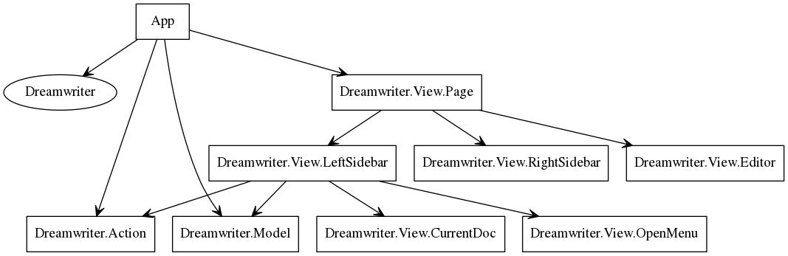

elmviz
######

A simple command line utility for producing SVG representations (via
[Graphviz dot language](http://www.graphviz.org/content/dot-language)) of the
dependency tree of modules within an [Elm](http://elm-lang.org/) application.

Sample
------
This is the output produced from running the script on the well known
[dreamwriter.io repository](https://github.com/rtfeldman/dreamwriter).

